<figure class="banner">
    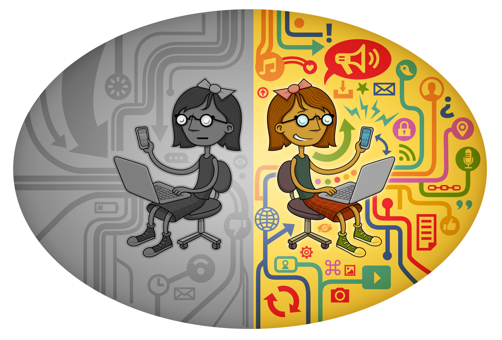
</figure>

<h2 id="sta-je-net-neutralnost">Šta je net neutralnost?</h2>

Net neutralnost je princip po kome provajderi Internet servisa trebaju da tretiraju sav sadržaju jednakim, bez prioritizovanja ili blokiranja određenog sadržaja ili kompletne web stranice, bez obzira na to odakle sadržaj potiče.

<h2 id="zasto-je-potrebna">Zašto je potreban ovaj princip?</h2>

Ukoliko net neutralnost ne postoji, provajderi Internet servisa bi bili u mogućnosti da urade sljedeće:

1. Da uskrate pristup određenim web stranicama.
2. Da dozvole pristup samo određenim web stranicama.
3. Da naplaćuju korisnicima dodatne pakete za pristupanje određenoj vrsti sadržaja na Internetu.
4. Da spriječe konkurenciji određene Internet kompanije da posluje pod jednakim uslovima.

Razlozi zašto nam je ovaj princip prijeko potreban:

1. Očekujemo da Internet bude otvoren. Svi znamo da je Internet globalna mreža umreženih računara. Globalna mreža dijela umreženih računara ne bi bila Internet kakvim ga poznajemo.
2. Sloboda govora zavisi od toga da se svako može pod jednakim uslovima boriti da se njegova riječ čuje.
3. Očekujemo da svi imamo jednak pristup informacijama o bilo kojoj temi.

<h2 id="kako-je-definisana">Kako je ovaj princip definisan u zakonima?</h2>

#### Europska Unija:

> End-users shall have the right to access and distribute information and content, use and provide applications and services, and use terminal equipment of their choice, irrespective of the end-user’s or provider’s location or the location, origin or destination of the information, content, application or service, via their internet access service.

<em><small><a href="http://eur-lex.europa.eu/legal-content/EN/TXT/HTML/?uri=CELEX:32015R2120&rid=2">REGULATION (EU) 2015/2120</a>, član 3, stav 2</small></em>

#### Hrvatska:

> promicanjem mogućnosti krajnjih korisnika usluga da pristupaju i raspačavaju podatke ili se koriste aplikacijama i uslugama po vlastitom izboru

<em><small><a href="https://www.zakon.hr/z/182/Zakon-o-elektroni%C4%8Dkim-komunikacijama">Zakon o elektroničkim komunikacijama</a>, član 5, stav 4</small></em>

#### Srbija:

> Obezbeđivanje mogućnosti krajnjih korisnika da, prilikom korišćenja javnih komunikacionih mreža i usluga, slobodno pristupaju i distribuiraju informacije, kao i da koriste aplikacije i usluge po svom izboru.

<em><small><a href="http://mtt.gov.rs/download/1(2)/Zakon-o-elektronskim-komunikacijama.pdf">Zakon o elektronskim komunikacijama</a>, član 3, stav 11</small></em>

#### Bosna i Hercegovina:

Trenutno nema zakon posvećen elektronskim komunikacijama.

<h2 id="ko-je-ugrozava">Ko ugrožava net neutralnost?</h2>

Net neutralnost ugrožavaju Internet provajderi koji tretiraju neke Internet resurse u povlašćenom položaju u odnosu na druge, kao i vlade koje ne čine dovoljno da tu praksu zaustave. Svi smo svjedoci paketa u kojima je sadržaj jedne Internet kompanije privilegovan u odnosu na druge, bilo da promet te web stranice ne ulazi u pakete podataka ili da se pristup određenim Internet servisima nudi besplatno. Naš cilj je spriječiti takvu praksu i tretirati sav sadržaj na Internetu jednako.

<h2 id="kako-se-borimo-za-nju">Kako smo odlučili da se borimo za ovaj princip?</h2>

Da bismo ukazali na ovaj problem, odlučili smo na jedan dan "ugasiti" domaći Internet. Web stranice izlistane ispod su dobrovoljno pristale da povuku svoju prisutnost na Internetu na jedan dan, da modifikuju svoje stranice tako da ukažu na problem, ili da jednostavno iskoriste svoje web prisustvo da provedu dan pričajući o principu net neutralnosti i zašto je važan.  

<h2 id="kome-smo-se-pridruzili">Kome smo se pridružili ovom akcijom?</h2>

Ovom akcijom smo se pridružili web kompanijama i organizacijama kao što su Amazon, Kickstarter, Vimeo, GitHub, reddit, DigitalOcean, DuckDuckGo, EFF, Mozilla, imgur, Patreon, Vivaldi, Netflix i drugim. Njih organizuje [Battle for the Net](https://www.battleforthenet.com/july12/) kampanja.

Dok ove kompanije / organizacije traže specifičnu akciju (ostavljanje komentara tako da net neutralnost ne bude narušena unutar SAD-a), mi smo tu da im pružimo podršku i da spomenemo kako ugrožavanje principa net neutralnosti utiče na nas na lokalnom nivou.

<h2 id="ko-ucestvuje-u-akciji">Akciji se pridružili</h2>

Spisak web stranica koje su učestvovale u akciji.

<figure class="third">
	<a href="https://blog.r3bl.me">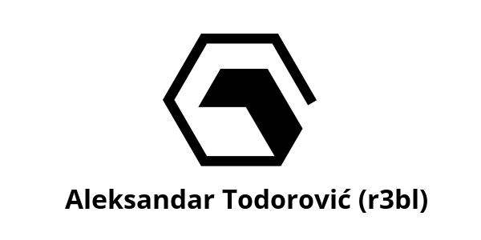</a>
	<a href="https://labs.rs">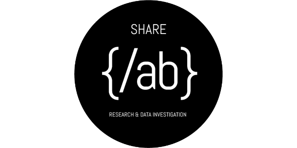</a>
  <a href="https://www.facebook.com/institutdigitalneslobode/">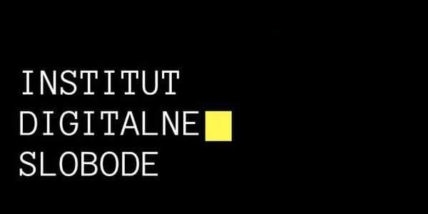</a>
</figure>
<figure class="third">
	<a href="https://libre.lugons.org/">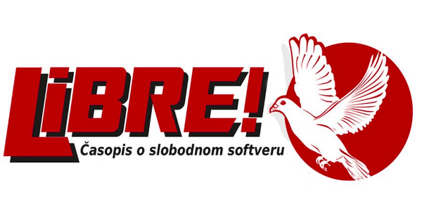</a>
	<a href="https://kompjuteras.com">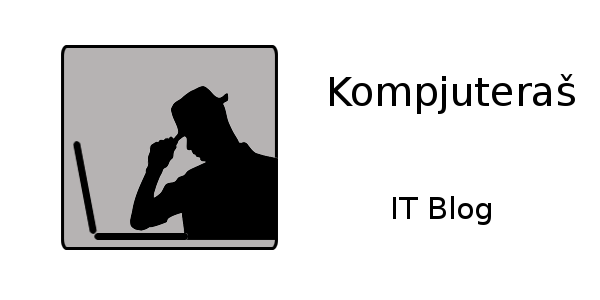</a>
	<a href="https://crypto.ba/">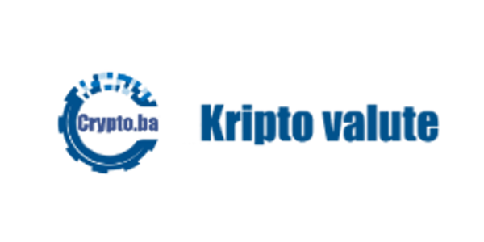</a>
	<figcaption></figcaption>
</figure>
<figure class="third">
	<a href="https://forum.balkan.io/">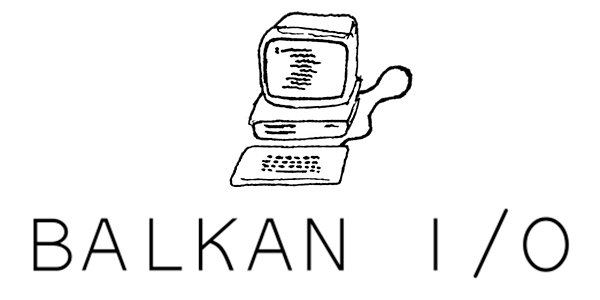</a>
  <a href="http://mozilla.rs/">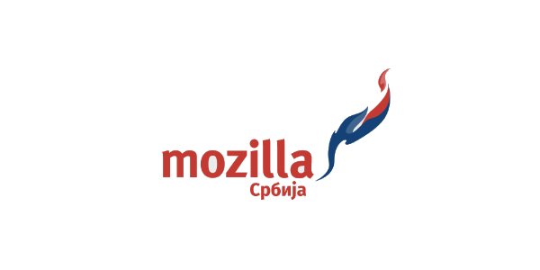</a>
  <a href="https://www.linuxzasve.com/">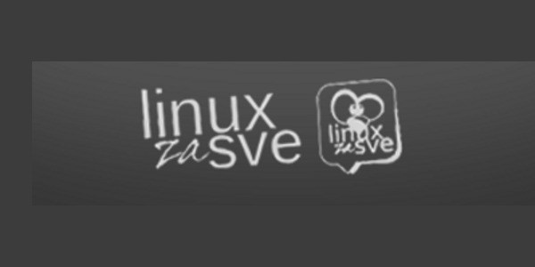</a>
  <figcaption></figcaption>
</figure>

<h2 id="kako-je-akcija-izgledala">Kako je akcija izgledala</h2>

  Neki od primjera kako je akcija izgledala.

<figure align="center">
	<a href="assets/img/primjeri/balkan-io.png">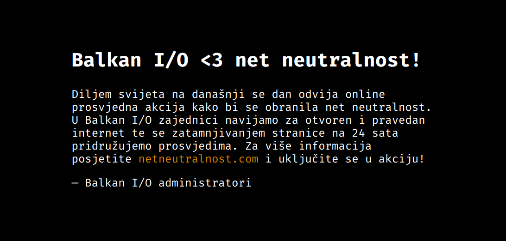</a>
</figure>

<figure align="center">
	<a href="assets/img/primjeri/kompjuteras.png">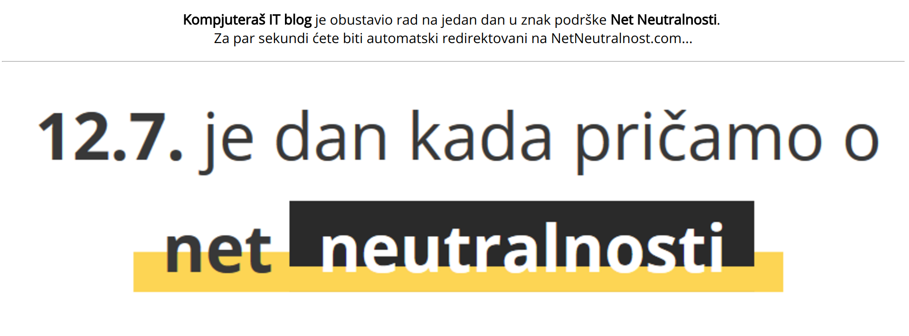</a>
</figure>

  Objavljeni članci:  
  <a href="http://www.netokracija.com/12-srpnja-internet-neutralnost-138684">12. srpnja: Dan borbe za poštivanje principa neutralnosti interneta – i u našoj regiji!</a> 
  <a href="http://www.linuxzasve.com/12-srpanj-dan-borbe-za-net-neutralnost">12. srpanj – dan borbe za net neutralnost</a>

<h2 id="sta-dalje">Šta će se dešavati dalje?</h2>

Borićemo se i dalje za princip net neutralnosti, međutim drugim sredstvima. Ova domena je odradila ono za šta je registrovana. Ukoliko imate neku ideju za ovu domenu, spreman sam je ustupiti (besplatno) vašoj ideji. Ukoliko je to slučaj, možete me kontaktirati na <a href="mailto:aleksandar@r3bl.me">aleksandar@r3bl.me</a>.

<h2 id="zahvale">Zahvale</h2>

Za kraj, želio bih da se zahvalim određenim osobama i organizacijama:

* Svim administratorima web stranica koji su odlučili da učestvuju u ovoj akciji.
* [Balkan I/O](https://forum.balkan.io/blackout.html) ekipi, za nesebičan doprinos dizajnu ove web stranice.
* Ekipi portala [Crypto.ba](https://crypto.ba/) na nesebičnoj podršci, od dizajna, preko podrške na društvenim mrežama, do moralne podrške.
* Ekipi portala [Netokracija](http://www.netokracija.com/), za medijsku podršku akciji.
* Svakom individualcu koji je pružio podršku na društvenim medijima.

Pokretač akcije, 
[Aleksandar Todorović](https://r3bl.me)  


